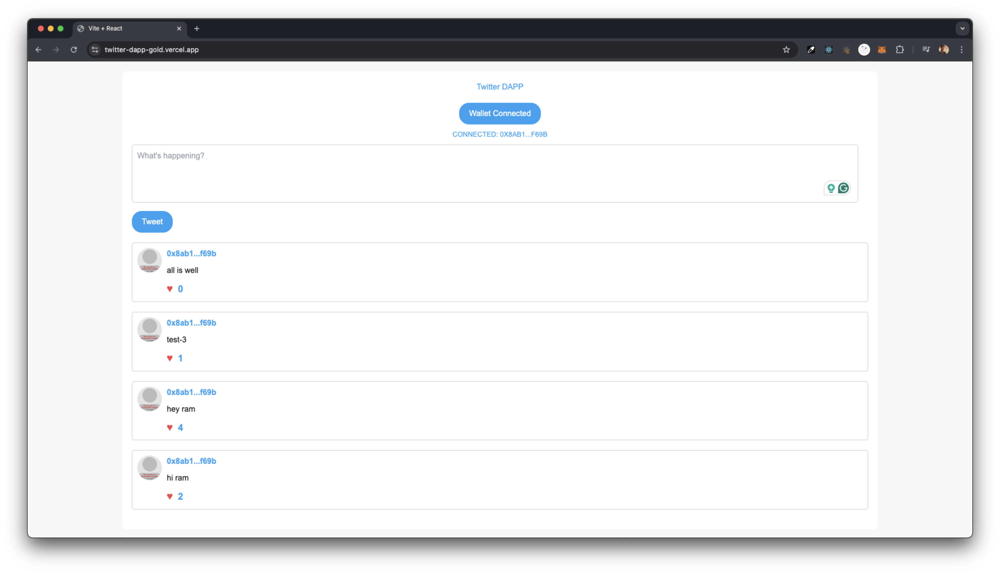
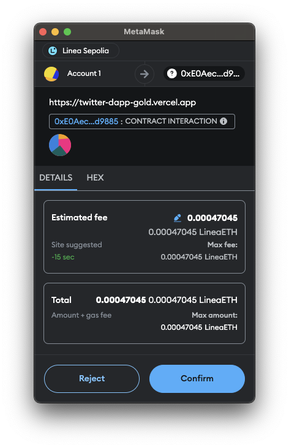

# Twitter DApp

A decentralized Twitter-like application built on Ethereum's Linea Sepolia test network using Solidity and Web3.js. This project allows users to post tweets, like/unlike tweets, and view their tweet history. The smart contract handles all the core functionalities such as creating tweets, liking/unliking them, and maintaining user interactions in a decentralized manner.

## Table of Contents

- [Overview](#overview)
- [Features](#features)
- [Tech Stack](#tech-stack)
- [Smart Contract](#smart-contract)
- [Setup Instructions](#setup-instructions)
- [How It Works](#how-it-works)
- [MetaMask Integration](#metamask-integration)
- [Screenshots](#screenshots)
- [License](#license)

## Overview

This DApp is designed to mimic basic Twitter functionality in a decentralized fashion. Users can:
- Create a tweet (limited to 280 characters).
- View all their tweets.
- Like and unlike tweets of any user.

The application runs on the Ethereum blockchain's Linea Sepolia test network, making it fully decentralized. MetaMask is used to interact with the blockchain, allowing for transactions like creating and liking tweets to be processed and verified.

## Features

- **Create Tweet**: Post a tweet with a maximum of 280 characters.
- **Like/Unlike Tweets**: Like or unlike any tweet on the platform.
- **View Tweets**: View all tweets of a user, sorted by timestamp.
- **Transaction Confirmation**: All interactions like creating or liking a tweet trigger MetaMask transaction prompts.

## Tech Stack

- **Frontend**: React.js, Tailwind CSS
- **Backend**: Solidity (Smart Contracts on Ethereum)
- **Blockchain**: Linea Sepolia Test Network
- **Web3 Integration**: Web3.js
- **Ethereum Wallet**: MetaMask

## Smart Contract

The smart contract is written in Solidity and deployed on the Linea Sepolia test network. The contract has the following key functionalities:

- `createTweet`: Allows users to post a tweet.
- `likeTweet`: Allows users to like a specific tweet.
- `unLikeTweet`: Allows users to unlike a tweet.
- `getAllTweets`: Retrieves all tweets posted by a user.

### Contract Structure:

```solidity
struct Tweet {
  uint id;
  address author;
  string content;
  uint256 timestamp;
  uint256 likes;
}
```

### Events:

- `createTweetEvent`: Emits when a new tweet is created.
- `likedTweetEvent`: Emits when a tweet is liked.
- `unlikedTweetEvent`: Emits when a tweet is unliked.

## Setup Instructions

### Prerequisites

1. Install [Node.js](https://nodejs.org/)
2. Install [MetaMask](https://metamask.io/) and connect it to the Linea Sepolia test network.

### Clone the Repository

```bash
git clone https://github.com/yourusername/twitter-dapp.git
cd twitter-dapp
```

### Install Dependencies

```bash
npm install
```

### Start the Development Server

```bash
npm start
```

### Connect MetaMask to Linea Sepolia Test Network

1. Open MetaMask.
2. Add a new network using the following details:
   - **Network Name**: Linea Sepolia
   - **New RPC URL**: `https://rpc-sepolia.linea.com`
   - **Chain ID**: `1234` (for example, check the correct chain ID for Linea Sepolia)
   - **Currency Symbol**: ETH

3. Make sure you have test ETH in your MetaMask wallet. You can request Sepolia test ETH from a faucet like [Sepolia Faucet](https://faucet.sepolia.dev/).

## How It Works

### Creating a Tweet

- Click on the **Post Tweet** button to create a new tweet.
- A MetaMask transaction prompt will appear. Confirm the transaction.
- After the transaction is mined, the tweet will appear in the list of tweets.

### Liking a Tweet

- Click on the **Like** button below any tweet.
- Confirm the MetaMask transaction.
- The number of likes will update after the transaction is mined.

### Viewing Tweets

- Tweets are fetched from the blockchain and displayed in reverse chronological order, meaning the latest tweets appear first.

## MetaMask Integration

This application integrates MetaMask to manage user accounts and interact with the blockchain. All actions, such as posting or liking a tweet, require MetaMask transaction confirmation. Ensure that you are connected to the Linea Sepolia network and have enough test ETH to cover transaction costs.

### MetaMask Transaction Process

1. After initiating a tweet creation or liking process, MetaMask will automatically pop up, asking you to confirm the transaction.
2. Once you confirm, the transaction will be sent to the blockchain for processing.
3. You will be notified when the transaction is successfully mined, and the updated data will reflect on the frontend.

## Screenshots

### Frontend



### MetaMask Transaction



## License

This project is licensed under the MIT License.
